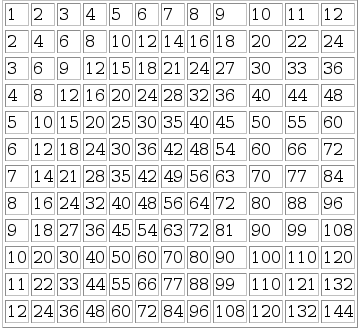

# PHP Exercise 2
		
> Complete ALL the exercises in this section.

## Part 1 - Variables

1.	Write a PHP program called ``variables.php`` that stores your name in a variable. 
	Then using the variable print ``My Name is <YOURNAME>``

1.	In ``variables.php`` create two variables for your ``firstname`` and ``lastname``. 
	Print your full name by concatenating both variables using the `.` operator.  Use ``print()`` function to print output.

1.	In ``variables.php`` print the length([*](https://www.w3schools.com/php/func_string_strlen.asp)) and uppercase([*](https://www.w3schools.com/php/func_string_strtoupper.asp)) of the ``firstname`` variable.

1.  Download card images from [here](images/cards.zip?raw=true) and copy the ``images`` folder into `htdocs`.  Each image is numbered from 1 to 52, one for each card in a deck.

1.  Save the the PHP program ``card.php`` below into your `htdocs` folder.  This code assigns a value to a ``card`` variable.  

    ``- card.php -``
    ```php
    <html>
    <body>

    <?php

    $card=1;

    // display the correct card image here

    ?>

    </body>
    </html>

    ```

    Given this card number you must display the correct card image.  For example, if `card=1` your program should display the Ace of Clubs.


## Part 2 - Control Structures

1.	Save the the PHP program ``grades.php`` below into your `htdocs` folder.  This code assigns a value to a ``grade`` variable.  
    ``- grades.php -``
    ```php
    <html>
    <body>

    <?php

    $mark=40;

    // print the correct grade here

    ?>

    </body>
    </html>

    ```

    Given this mark you must print the correct grade.  For example, if ``mark=40`` your program should print ``Pass``.
    
	| Grade	      | Mark    |
	|-------------|---------|
	| Distinction |	70-100  |
	| Merit 1 	  | 60-69   |
	| Merit 2 	  | 50-59   |
	| Pass 		  | 40-48   |
	| Fail 		  | 0-39    |

	Test the correct grade is displayed even when marks such as 70, 69, 40, 39, etc. are used.

1.	In the previous solution does your code print a message such a *Invalid mark* if a mark > 100 or mark < 0 is input? 
	If NOT, modify your code now to do so.

1.  Write a PHP program called ``sqr.php`` that prints the following in your browser:

    ```
    1*1=1
    2*2=2
    3*3=9
    4*4=16
    5*5=25
    6*6=36
    7*7=49
    8*8=64
    9*9=81
    10*10=100
    ```

    Use a ``for`` loop.

1.	Write a PHP program called ``table.php`` that prints the multiplication table shown below

	

    Use a ``for`` loop.  You must use correct HTML table elements([*](https://www.w3schools.com/html/html_tables.asp))

