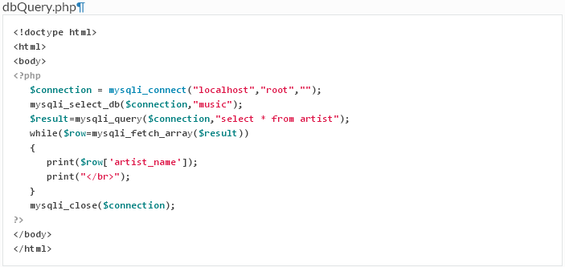

# PHP Ex 3 - Database Queries

> Complete ALL the exercises in this section.  If you need a solution just ask.

		
1.	Write and execute the PHP program ``dbQuery.php`` that demonstrates how to retrieve data from an ``artist`` table in a database called [music](../files/music.sql).

	
	
1.	Create a new PHP program called ``albumNames.php`` that prints the names of the albums in ``albums`` table from the ``music`` database.  Use the code from ``dbQuery.php`` for your solution.

1.	Using the *phpMyAdmin* tool create a new database, table and some records:

	(a)	Create a database called ``footballDB``

	(b)	Create a table called ``clubs`` with two fields - ``name`` and ``ground``.  Use the data type ``varchar`` and appropriate sizes.

	(c)	Insert at least 5 records into the new table
	
1.	Write a PHP program ``listClubs.php`` that prints the club names in an ordered list (``<ol>``)

1.	Write a PHP script called ``clubTable.php`` that displays ALL the ``clubs`` table data inside a HTML table.

1.	Write a PHP script called ``clubDropdown.php`` that displays the club names inside a dropdown box.
	

